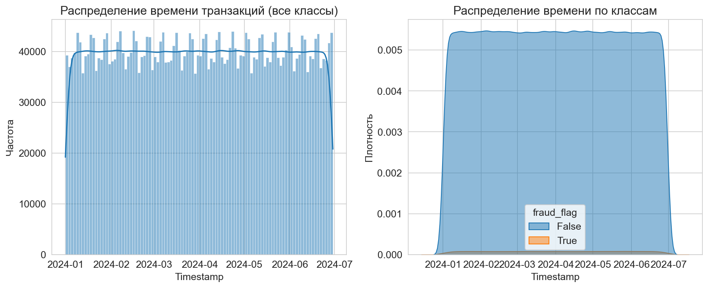
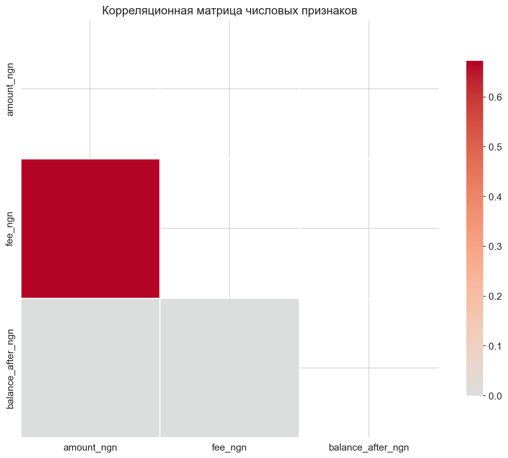
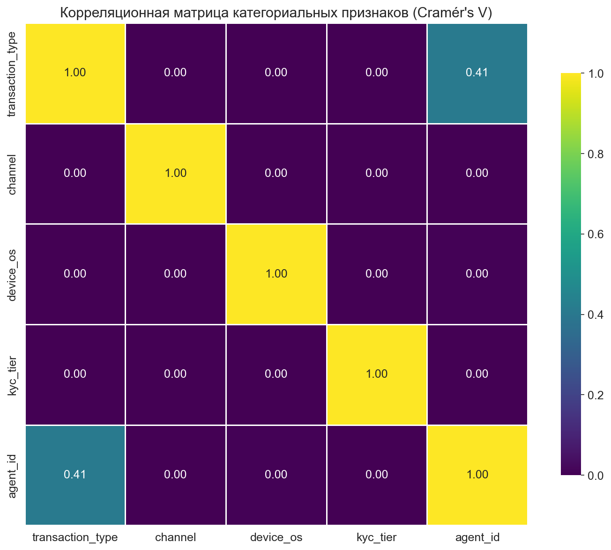
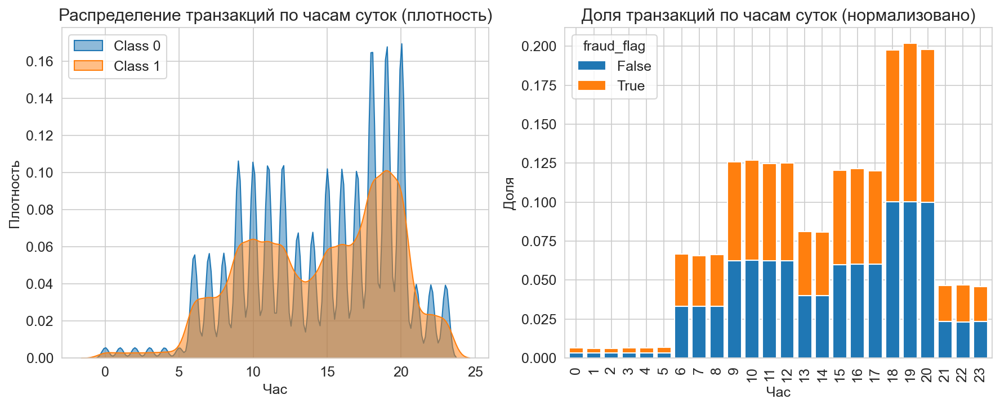

# Отчёт по исследовательскому анализу данных (EDA)

## 1. Общая информация
- **Источник данных**: `../data/raw/nigerian_mobile_money_full.parquet`
- **Количество строк**: 4000000
- **Количество столбцов**: 14
- **Типы данных**:
transaction_id                  str
wallet_id                       str
timestamp            datetime64[ns]
transaction_type                str
amount_ngn                  float64
fee_ngn                     float64
balance_after_ngn           float64
agent_id                        str
channel                         str
device_os                       str
kyc_tier                        str
fraud_flag                     bool
churn_30d                      bool
hour                          int32

## 2. Пропуски
Пропусков не обнаружено.

## 3. Распределение классов
| Класс | Количество | Процент |
|-------|------------|--------|
| 0 (норма) | 3940000 | 98.50% |
| 1 (мошенничество) | 60000 | 1.50% |

*Ожидалось ~1% мошеннических транзакций, фактически получено 1.50%.*

## 4. Выбросы (метод IQR, коэффициент 1.5)
| Признак | Количество выбросов | Процент |
|---------|-------------------|--------|
| amount_ngn  | 477971 | 11.95% |
| balance_after_ngn    | 311041   | 7.78% |

*Примечание: выбросы в сумме транзакций могут быть информативны для выявления мошенничества.*

## 5. Распределение суммы транзакций по классам
На графиках ниже видно, что мошеннические транзакции в основном имеют небольшие суммы (логарифмическая шкала).

## 6. Временные паттерны
Распределение времени транзакций показывает, что мошеннические операции могут быть сконцентрированы в определённых временных интервалах.

Количество транзакций в интервалах времени:

## 7. Корреляционная матрица

  

## 8. Заключение
- Данные не содержат пропусков.
- Классы сильно несбалансированы, что требует специальных методов при построении модели.
- Признак и 'amount_ngn', 'balance_after_ngn' имеют выбросы, и они могут быть важны для обнаружения мошенничества.
- Никаких явных пиков мошеннических транзакций в определённые часы не обнаружено.

- Сильнай взаимной корреляции между признаками не обнаружено

Отчёт создан автоматически.
