# Отчёт по созданным признакам

Дата генерации: 2026-04-01 19:39:58

Количество строк в датасете: 4,000,000

Целевая переменная: `fraud_flag`

## Общая структура признаков
- Всего признаков (без меток): 109
- Числовые признаки: 82
- Категориальные: 7

## Список признаков с описанием

| Признак | Тип | Описание | Экономическая интерпретация |
|---------|-----|----------|-----------------------------|
| index | int64 | Автоматически сгенерированный признак | Не указано |
| transaction_type | str | Автоматически сгенерированный признак | Не указано |
| amount_ngn | float64 | Сумма транзакции (нормализованная) | Объём операции, влияет на комиссию и риск |
| fee_ngn | float64 | Комиссия (нормализованная) | Расходы пользователя, часто завышены у мошенников |
| balance_after_ngn | float64 | Баланс после операции (нормализованный) | Показатель ликвидности, низкий баланс → риск |
| channel | str | Автоматически сгенерированный признак | Не указано |
| device_os | str | Автоматически сгенерированный признак | Не указано |
| kyc_tier | str | Автоматически сгенерированный признак | Не указано |
| fee_rate | float64 | Относительная комиссия | Комиссия / сумма, может указывать на нестандартные операции |
| balance_to_amount | float64 | Отношение баланса к сумме | Показывает, насколько операция снижает баланс |
| is_round_amount | int64 | Круглая сумма | Мошенники часто используют круглые суммы (50k,100k,200k) |
| is_small_amount | int64 | Малая сумма (<1000 NGN) | Характерно для микро-транзакций, часто легитимно |
| transaction_type_airtime | float64 | Тип транзакции: airtime | Индикатор типа операции |
| transaction_type_billpay | float64 | Тип транзакции: billpay | Индикатор типа операции |
| transaction_type_cashin | float64 | Тип транзакции: cashin | Индикатор типа операции |
| transaction_type_cashout | float64 | Тип транзакции: cashout | Индикатор типа операции |
| transaction_type_data | float64 | Тип транзакции: data | Индикатор типа операции |
| transaction_type_p2p_receive | float64 | Тип транзакции: p2p_receive | Индикатор типа операции |
| transaction_type_p2p_send | float64 | Тип транзакции: p2p_send | Индикатор типа операции |
| channel_agent | float64 | Канал: agent | Индикатор канала |
| channel_app | float64 | Канал: app | Индикатор канала |
| channel_ussd | float64 | Канал: ussd | Индикатор канала |
| channel_web | float64 | Канал: web | Индикатор канала |
| device_os_android | float64 | ОС: android | Индикатор ОС |
| device_os_feature_phone | float64 | ОС: feature_phone | Индикатор ОС |
| device_os_ios | float64 | ОС: ios | Индикатор ОС |
| kyc_tier_tier1 | float64 | KYC: tier1 | Индикатор уровня KYC |
| kyc_tier_tier2 | float64 | KYC: tier2 | Индикатор уровня KYC |
| kyc_tier_tier3 | float64 | KYC: tier3 | Индикатор уровня KYC |
| wallet_txn_count | int64 | Общее число транзакций кошелька | Активность кошелька, новые кошельки рискованнее |
| wallet_total_amount | float64 | Общая сумма операций кошелька | Объём, влияет на доверие |
| wallet_avg_amount | float64 | Средний чек кошелька | Поведенческий паттерн |
| wallet_std_amount | float64 | Стандартное отклонение сумм | Нестабильность может указывать на мошенничество |
| wallet_avg_fee | float64 | Средняя комиссия | Склонность к дорогим операциям |
| wallet_type_diversity | int64 | Разнообразие типов операций | Низкое разнообразие → риск оттока или мошенничества |
| wallet_channel_diversity | int64 | Разнообразие каналов | Мошенники часто используют один канал |
| agent_txn_count | int64 | Число операций агента | Активность агента, новые агенты рискованны |
| agent_total_amount | float64 | Суммарный оборот агента | Надёжность агента |
| agent_avg_amount | float64 | Средний чек агента | Типичный размер выдачи/внесения |
| agent_cashout_ratio | float64 | Доля cashout у агента | Высокая доля выдач может указывать на отмывание |
| txn_count_1h | float64 | Число транзакций за последний час | Аномальная активность в коротком окне |
| amount_sum_1h | float64 | Сумма за последний час | Всплески объёма |
| amount_mean_1h | float64 | Средняя сумма за час | Изменение паттерна |
| amount_std_1h | float64 | Разброс сумм за час | Нестабильность |
| txn_count_24h | float64 | Число транзакций за сутки | Суточная активность |
| amount_sum_24h | float64 | Сумма за сутки | Дневной объём |
| amount_mean_24h | float64 | Средняя сумма за сутки | Типичный размер |
| amount_std_24h | float64 | Разброс за сутки | Вариативность |
| txn_count_7D | float64 | Автоматически сгенерированный признак | Не указано |
| amount_sum_7D | float64 | Автоматически сгенерированный признак | Не указано |
| amount_mean_7D | float64 | Автоматически сгенерированный признак | Не указано |
| amount_std_7D | float64 | Автоматически сгенерированный признак | Не указано |
| time_since_last | float64 | Время с последней транзакции (сек) | Длительные паузы могут указывать на взлом |
| time_since_last_same_type | float64 | Время с последней такой же операции | Необычная частота конкретного типа |
| hour | int64 | Час суток | Ночные операции более рискованны |
| dayofweek | int64 | День недели | Выходные/будни |
| is_weekend | int64 | Выходной | Мошенники активизируются в выходные |
| is_night | int64 | Ночь (22-6) | Аномальное время |
| pair_txn_count | int64 | Число операций с данным агентом | Связность кошелёк-агент |
| pair_total_amount | float64 | Сумма операций с агентом | Объём взаимодействия |
| pair_avg_amount | float64 | Средний чек с агентом | Типичная сумма для пары |
| unique_agents_count | int64 | Число уникальных агентов | Ширина сети, мошенники часто ограничены |
| cluster_label | int32 | Метка кластера | Группа схожих транзакций (0..9) |
| cluster_0_dist | float64 | Расстояние до кластера 0 | Близость к типичным транзакциям кластера |
| cluster_1_dist | float64 | Расстояние до кластера 1 | Близость к типичным транзакциям кластера |
| cluster_2_dist | float64 | Расстояние до кластера 2 | Близость к типичным транзакциям кластера |
| cluster_3_dist | float64 | Расстояние до кластера 3 | Близость к типичным транзакциям кластера |
| cluster_4_dist | float64 | Расстояние до кластера 4 | Близость к типичным транзакциям кластера |
| cluster_5_dist | float64 | Расстояние до кластера 5 | Близость к типичным транзакциям кластера |
| cluster_6_dist | float64 | Расстояние до кластера 6 | Близость к типичным транзакциям кластера |
| cluster_7_dist | float64 | Расстояние до кластера 7 | Близость к типичным транзакциям кластера |
| cluster_8_dist | float64 | Расстояние до кластера 8 | Близость к типичным транзакциям кластера |
| cluster_9_dist | float64 | Расстояние до кластера 9 | Близость к типичным транзакциям кластера |
| cluster_0 | int64 | Автоматически сгенерированный признак | Не указано |
| cluster_1 | int64 | Автоматически сгенерированный признак | Не указано |
| cluster_2 | int64 | Автоматически сгенерированный признак | Не указано |
| cluster_3 | int64 | Автоматически сгенерированный признак | Не указано |
| cluster_4 | int64 | Автоматически сгенерированный признак | Не указано |
| cluster_5 | int64 | Автоматически сгенерированный признак | Не указано |
| cluster_6 | int64 | Автоматически сгенерированный признак | Не указано |
| cluster_7 | int64 | Автоматически сгенерированный признак | Не указано |
| cluster_8 | int64 | Автоматически сгенерированный признак | Не указано |
| cluster_9 | int64 | Автоматически сгенерированный признак | Не указано |
| anomaly_score | float64 | Оценка аномальности (Isolation Forest) | Ниже – более аномально |
| is_anomaly | int64 | Бинарный флаг аномалии | Обнаружена выбросная транзакция |
| autoenc_0 | float32 | Латентный признак автоэнкодера 0 | Нелинейная комбинация исходных признаков |
| autoenc_1 | float32 | Латентный признак автоэнкодера 1 | Нелинейная комбинация исходных признаков |
| autoenc_2 | float32 | Латентный признак автоэнкодера 2 | Нелинейная комбинация исходных признаков |
| autoenc_3 | float32 | Латентный признак автоэнкодера 3 | Нелинейная комбинация исходных признаков |
| autoenc_4 | float32 | Латентный признак автоэнкодера 4 | Нелинейная комбинация исходных признаков |
| autoenc_5 | float32 | Латентный признак автоэнкодера 5 | Нелинейная комбинация исходных признаков |
| autoenc_6 | float32 | Латентный признак автоэнкодера 6 | Нелинейная комбинация исходных признаков |
| autoenc_7 | float32 | Латентный признак автоэнкодера 7 | Нелинейная комбинация исходных признаков |
| autoenc_8 | float32 | Латентный признак автоэнкодера 8 | Нелинейная комбинация исходных признаков |
| autoenc_9 | float32 | Латентный признак автоэнкодера 9 | Нелинейная комбинация исходных признаков |
| autoenc_10 | float32 | Латентный признак автоэнкодера 10 | Нелинейная комбинация исходных признаков |
| autoenc_11 | float32 | Латентный признак автоэнкодера 11 | Нелинейная комбинация исходных признаков |
| autoenc_12 | float32 | Латентный признак автоэнкодера 12 | Нелинейная комбинация исходных признаков |
| autoenc_13 | float32 | Латентный признак автоэнкодера 13 | Нелинейная комбинация исходных признаков |
| autoenc_14 | float32 | Латентный признак автоэнкодера 14 | Нелинейная комбинация исходных признаков |
| autoenc_15 | float32 | Латентный признак автоэнкодера 15 | Нелинейная комбинация исходных признаков |
| autoenc_16 | float32 | Латентный признак автоэнкодера 16 | Нелинейная комбинация исходных признаков |
| autoenc_17 | float32 | Латентный признак автоэнкодера 17 | Нелинейная комбинация исходных признаков |
| autoenc_18 | float32 | Латентный признак автоэнкодера 18 | Нелинейная комбинация исходных признаков |
| autoenc_19 | float32 | Латентный признак автоэнкодера 19 | Нелинейная комбинация исходных признаков |

## Статистики числовых признаков

```
                                  count          mean           std           min           25%           50%           75%           max
index                         4000000.0  2.000000e+06  1.154701e+06      0.000000  9.999998e+05  2.000000e+06  2.999999e+06  3.999999e+06
amount_ngn                    4000000.0  1.401190e-17  1.000000e+00     -0.378070 -3.247318e-01 -2.561546e-01 -5.423263e-02  3.771660e+01
fee_ngn                       4000000.0 -1.014655e-17  1.000000e+00     -0.465148 -4.651477e-01 -4.651477e-01 -4.651477e-01  3.169723e+00
balance_after_ngn             4000000.0  1.352873e-16  1.000000e+00     -0.761577 -5.279540e-01 -3.007003e-01  1.452103e-01  6.751985e+01
fraud_flag                    4000000.0  1.500000e-02  1.215525e-01      0.000000  0.000000e+00  0.000000e+00  0.000000e+00  1.000000e+00
churn_30d                     4000000.0  6.000000e-02  2.374869e-01      0.000000  0.000000e+00  0.000000e+00  0.000000e+00  1.000000e+00
fee_rate                      4000000.0  2.764482e+00  1.631924e+01   -335.760088  1.383708e+00  1.738330e+00  2.942547e+00  1.061880e+02
balance_to_amount             4000000.0 -1.482738e-02  5.351736e+01 -22180.484187 -8.995892e-01  6.832113e-01  1.810172e+00  9.664663e+03
is_round_amount               4000000.0  0.000000e+00  0.000000e+00      0.000000  0.000000e+00  0.000000e+00  0.000000e+00  0.000000e+00
is_small_amount               4000000.0  1.000000e+00  0.000000e+00      1.000000  1.000000e+00  1.000000e+00  1.000000e+00  1.000000e+00
transaction_type_airtime      4000000.0  2.495293e-01  4.327406e-01      0.000000  0.000000e+00  0.000000e+00  0.000000e+00  1.000000e+00
transaction_type_billpay      4000000.0  1.500937e-01  3.571633e-01      0.000000  0.000000e+00  0.000000e+00  0.000000e+00  1.000000e+00
transaction_type_cashin       4000000.0  1.001973e-01  3.002629e-01      0.000000  0.000000e+00  0.000000e+00  0.000000e+00  1.000000e+00
transaction_type_cashout      4000000.0  8.007525e-02  2.714097e-01      0.000000  0.000000e+00  0.000000e+00  0.000000e+00  1.000000e+00
transaction_type_data         4000000.0  2.015475e-02  1.405295e-01      0.000000  0.000000e+00  0.000000e+00  0.000000e+00  1.000000e+00
transaction_type_p2p_receive  4000000.0  1.998358e-01  3.998768e-01      0.000000  0.000000e+00  0.000000e+00  0.000000e+00  1.000000e+00
transaction_type_p2p_send     4000000.0  2.001140e-01  4.000855e-01      0.000000  0.000000e+00  0.000000e+00  0.000000e+00  1.000000e+00
channel_agent                 4000000.0  1.295740e-01  3.358342e-01      0.000000  0.000000e+00  0.000000e+00  0.000000e+00  1.000000e+00
channel_app                   4000000.0  3.498108e-01  4.769101e-01      0.000000  0.000000e+00  0.000000e+00  1.000000e+00  1.000000e+00
channel_ussd                  4000000.0  5.007280e-01  4.999995e-01      0.000000  0.000000e+00  1.000000e+00  1.000000e+00  1.000000e+00
channel_web                   4000000.0  1.988725e-02  1.396129e-01      0.000000  0.000000e+00  0.000000e+00  0.000000e+00  1.000000e+00
device_os_android             4000000.0  6.999277e-01  4.582892e-01      0.000000  0.000000e+00  1.000000e+00  1.000000e+00  1.000000e+00
device_os_feature_phone       4000000.0  2.500275e-01  4.330286e-01      0.000000  0.000000e+00  0.000000e+00  1.000000e+00  1.000000e+00
device_os_ios                 4000000.0  5.004475e-02  2.180373e-01      0.000000  0.000000e+00  0.000000e+00  0.000000e+00  1.000000e+00
kyc_tier_tier1                4000000.0  5.850488e-01  4.927137e-01      0.000000  0.000000e+00  1.000000e+00  1.000000e+00  1.000000e+00
kyc_tier_tier2                4000000.0  3.620695e-01  4.805988e-01      0.000000  0.000000e+00  0.000000e+00  1.000000e+00  1.000000e+00
kyc_tier_tier3                4000000.0  5.288175e-02  2.237974e-01      0.000000  0.000000e+00  0.000000e+00  0.000000e+00  1.000000e+00
wallet_txn_count              4000000.0  5.138093e+03  1.744695e+04      1.000000  8.000000e+00  4.500000e+01  6.750000e+02  1.000050e+05
wallet_total_amount           4000000.0 -4.925197e-01  3.504244e+01   -201.843515 -3.773020e+00 -6.342243e-01  3.309456e+00  1.322766e+02
wallet_avg_amount             4000000.0  1.631406e-17  3.066461e-01     -0.378070 -1.092270e-01 -1.049355e-02  2.347277e-02  3.771660e+01
wallet_std_amount             3944722.0  7.617142e-01  6.475501e-01      0.000000  3.611216e-01  7.255216e-01  9.822208e-01  2.692892e+01
wallet_avg_fee                4000000.0 -6.508571e-18  3.065736e-01     -0.465148 -1.028120e-01 -4.332180e-03  5.428519e-02  3.169723e+00
wallet_type_diversity         4000000.0  5.656853e+00  1.764286e+00      1.000000  4.000000e+00  7.000000e+00  7.000000e+00  7.000000e+00
wallet_channel_diversity      4000000.0  3.321639e+00  8.695676e-01      1.000000  3.000000e+00  4.000000e+00  4.000000e+00  4.000000e+00
agent_txn_count               4000000.0  2.687826e+06  1.260432e+06     43.000000  3.278910e+06  3.278910e+06  3.278910e+06  3.278910e+06
agent_total_amount            4000000.0 -6.611932e+04  3.101075e+04 -80661.927182 -8.066193e+04 -8.066193e+04 -8.066193e+04  8.380917e+01
agent_avg_amount              4000000.0  1.896261e-17  7.750890e-02     -0.201668 -2.460023e-02 -2.460023e-02 -2.460023e-02  1.114270e+00
agent_cashout_ratio           4000000.0  8.007525e-02  1.725618e-01      0.000000  0.000000e+00  0.000000e+00  0.000000e+00  6.623377e-01
txn_count_1h                   780642.0  9.019552e+00  1.266527e+01      1.000000  1.000000e+00  3.000000e+00  1.100000e+01  8.100000e+01
amount_sum_1h                  780642.0  6.618967e-04  2.916435e+00    -15.001046 -8.388305e-01 -3.094924e-01  1.934075e-01  5.770335e+01
amount_mean_1h                 780642.0  7.450177e-05  6.724379e-01     -0.378070 -2.656792e-01 -1.367793e-01  4.355347e-02  3.771660e+01
amount_std_1h                 4000000.0  7.532794e-02  3.556319e-01      0.000000  0.000000e+00  0.000000e+00  0.000000e+00  2.692353e+01
txn_count_24h                 1688935.0  6.702434e+01  1.392601e+02      1.000000  2.000000e+00  7.000000e+00  4.700000e+01  6.320000e+02
amount_sum_24h                1688935.0  1.091707e-02  8.074214e+00    -60.383819 -1.359050e+00 -3.285417e-01  5.439135e-01  9.519920e+01
amount_mean_24h               1688935.0  3.111391e-04  5.916205e-01     -0.378070 -2.294856e-01 -7.328187e-02  3.979230e-02  3.771660e+01
amount_std_24h                4000000.0  2.139476e-01  5.231224e-01      0.000000  0.000000e+00  0.000000e+00  2.034972e-01  2.692892e+01
txn_count_7D                  2563571.0  3.041474e+02  8.129086e+02      1.000000  2.000000e+00  1.000000e+01  1.050000e+02  4.063000e+03
amount_sum_7D                 2563571.0 -9.792682e-03  1.743667e+01   -137.308498 -1.716856e+00 -3.361614e-01  8.866076e-01  2.303305e+02
amount_mean_7D                2563571.0 -6.596070e-05  5.400581e-01     -0.378070 -2.073885e-01 -4.756539e-02  3.120626e-02  3.771660e+01
amount_std_7D                 4000000.0  3.602007e-01  6.179823e-01      0.000000  0.000000e+00  2.693969e-02  6.286736e-01  2.692622e+01
time_since_last               4000000.0  7.665898e+05  1.627884e+06      0.000000  1.800000e+03  7.698000e+04  6.865200e+05  1.549080e+07
time_since_last_same_type     4000000.0  9.531434e+05  2.061203e+06      0.000000  0.000000e+00  3.858000e+04  7.675800e+05  1.555476e+07
hour                          4000000.0  1.457659e+01  4.879667e+00      0.000000  1.100000e+01  1.500000e+01  1.900000e+01  2.300000e+01
dayofweek                     4000000.0  2.983401e+00  1.992986e+00      0.000000  1.000000e+00  3.000000e+00  5.000000e+00  6.000000e+00
is_weekend                    4000000.0  2.816520e-01  4.498046e-01      0.000000  0.000000e+00  0.000000e+00  1.000000e+00  1.000000e+00
is_night                      4000000.0  9.986425e-02  2.998190e-01      0.000000  0.000000e+00  0.000000e+00  0.000000e+00  1.000000e+00
pair_txn_count                4000000.0  3.452486e+03  1.306186e+04      1.000000  3.000000e+00  1.600000e+01  2.700000e+02  8.208800e+04
pair_total_amount             4000000.0 -8.651305e+01  3.228535e+02  -2030.655349 -7.971792e+00 -8.066219e-01  4.011881e-02  7.677342e+01
pair_avg_amount               4000000.0  1.622880e-17  5.651099e-01     -0.378070 -1.785969e-01 -4.460018e-02  2.534105e-03  3.771660e+01
unique_agents_count           4000000.0  5.839293e+02  1.658285e+03      1.000000  2.000000e+00  9.000000e+00  1.230000e+02  8.397000e+03
cluster_0_dist                4000000.0  1.545390e+01  1.965570e+00      4.753180  1.480229e+01  1.521815e+01  1.577316e+01  3.735040e+02
cluster_1_dist                4000000.0  6.882084e+00  3.433129e+00      2.729925  4.915696e+00  6.066600e+00  7.822309e+00  3.731895e+02
cluster_2_dist                4000000.0  1.070664e+01  2.705669e+00      3.780437  9.543834e+00  1.025191e+01  1.115563e+01  3.732001e+02
cluster_3_dist                4000000.0  1.641993e+01  2.437247e+00      2.979789  1.604678e+01  1.646964e+01  1.709688e+01  3.735141e+02
cluster_4_dist                4000000.0  9.403526e+00  2.481326e+00      3.822400  8.280369e+00  9.014033e+00  9.982222e+00  3.732577e+02
cluster_5_dist                4000000.0  8.631308e+00  3.062203e+00      2.463636  7.485256e+00  8.013195e+00  8.967194e+00  3.732416e+02
cluster_6_dist                4000000.0  7.099109e+00  3.413266e+00      2.120101  5.210457e+00  6.330266e+00  8.032779e+00  3.732140e+02
cluster_7_dist                4000000.0  8.450890e+00  3.091485e+00      2.517774  7.292715e+00  7.829565e+00  8.801370e+00  3.732106e+02
cluster_8_dist                4000000.0  7.019682e+00  3.476683e+00      2.092389  5.079934e+00  6.288965e+00  8.022010e+00  3.731991e+02
cluster_9_dist                4000000.0  7.118675e+00  3.386145e+00      2.833425  5.233355e+00  6.292940e+00  8.019525e+00  3.731741e+02
cluster_0                     4000000.0  6.125000e-03  7.802234e-02      0.000000  0.000000e+00  0.000000e+00  0.000000e+00  1.000000e+00
cluster_1                     4000000.0  2.496562e-01  4.328141e-01      0.000000  0.000000e+00  0.000000e+00  0.000000e+00  1.000000e+00
cluster_2                     4000000.0  1.955100e-02  1.384513e-01      0.000000  0.000000e+00  0.000000e+00  0.000000e+00  1.000000e+00
cluster_3                     4000000.0  2.016825e-02  1.405756e-01      0.000000  0.000000e+00  0.000000e+00  0.000000e+00  1.000000e+00
cluster_4                     4000000.0  4.340550e-02  2.037682e-01      0.000000  0.000000e+00  0.000000e+00  0.000000e+00  1.000000e+00
cluster_5                     4000000.0  7.462725e-02  2.627890e-01      0.000000  0.000000e+00  0.000000e+00  0.000000e+00  1.000000e+00
cluster_6                     4000000.0  1.353187e-01  3.420638e-01      0.000000  0.000000e+00  0.000000e+00  0.000000e+00  1.000000e+00
cluster_7                     4000000.0  9.314025e-02  2.906289e-01      0.000000  0.000000e+00  0.000000e+00  0.000000e+00  1.000000e+00
cluster_8                     4000000.0  1.719390e-01  3.773275e-01      0.000000  0.000000e+00  0.000000e+00  0.000000e+00  1.000000e+00
cluster_9                     4000000.0  1.860688e-01  3.891622e-01      0.000000  0.000000e+00  0.000000e+00  0.000000e+00  1.000000e+00
anomaly_score                 4000000.0 -4.269366e-01  4.671172e-02     -0.686475 -4.492257e-01 -4.160645e-01 -3.926372e-01 -3.523387e-01
is_anomaly                    4000000.0  9.939250e-03  9.919911e-02      0.000000  0.000000e+00  0.000000e+00  0.000000e+00  1.000000e+00
```

## Распределение категориальных признаков (топ-5 значений)

### transaction_id
```
transaction_id
21ba44cf-b11d-4846-94c9-4ce6a59e8b8e    1
5db2d496-3274-4022-9759-a6b2d382e253    1
82cb9580-41b7-414d-9292-5d35648b8dad    1
e50b3202-0cb2-4806-9ed8-18874b0d311d    1
fa46fef2-0501-48f6-a0df-8dd4c2cc44f7    1
```

### transaction_type
```
transaction_type
airtime        998117
p2p_send       800456
p2p_receive    799343
billpay        600375
cashin         400789
```

### agent_id
```
agent_id
                3278910
AGT-00005275        104
AGT-00003497        103
AGT-00009528        103
AGT-00006640        103
```

### channel
```
channel
ussd     2002912
app      1399243
agent     518296
web        79549
```

### device_os
```
device_os
android          2799711
feature_phone    1000110
ios               200179
```

### kyc_tier
```
kyc_tier
tier1    2340195
tier2    1448278
tier3     211527
```

### wallet_id
```
wallet_id
WLT-00000001    100005
WLT-00000002     55370
WLT-00000003     39428
WLT-00000004     30989
WLT-00000005     25414
```

## Визуализации

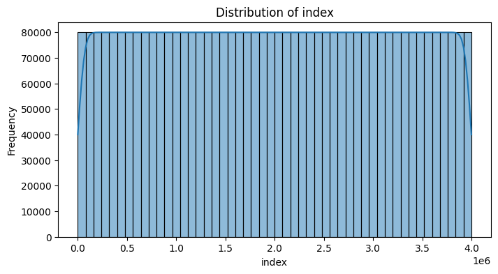

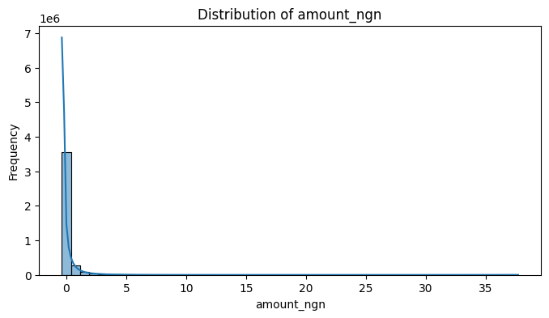

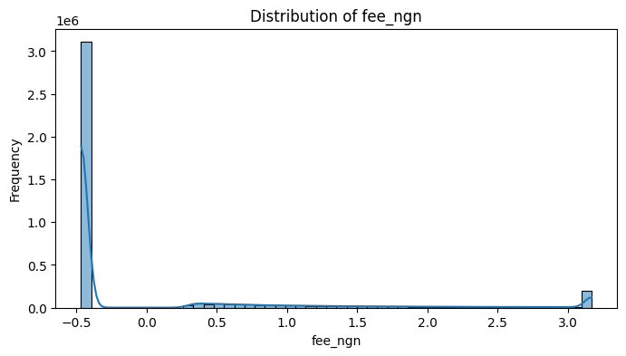

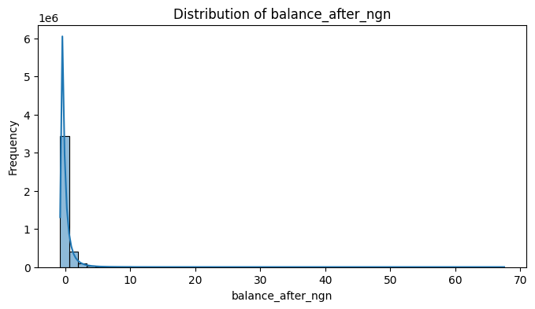

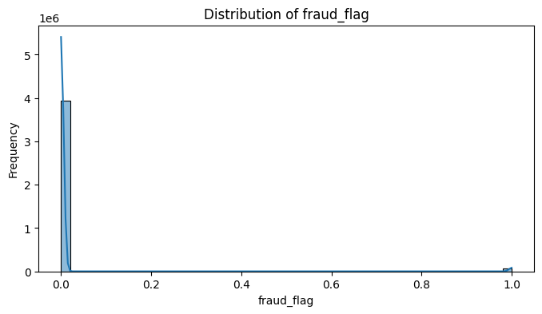

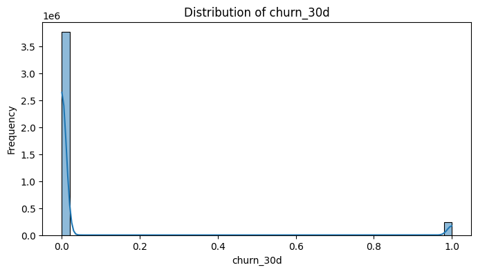

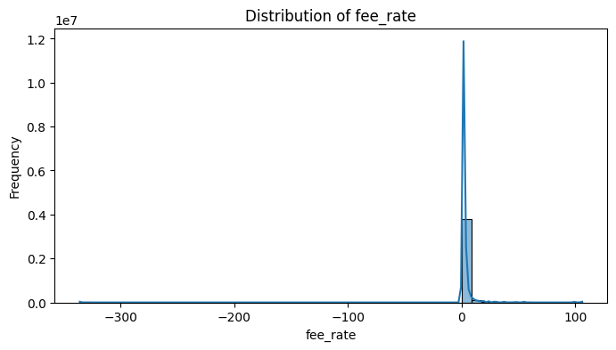

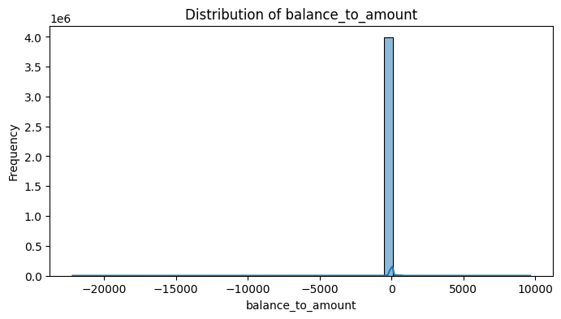

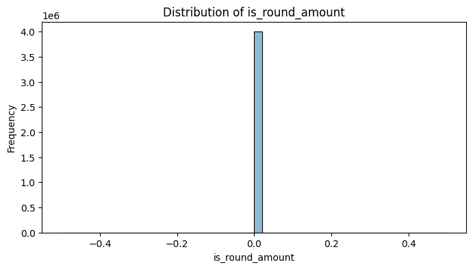

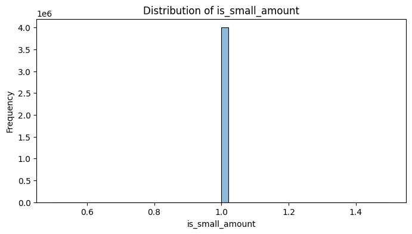

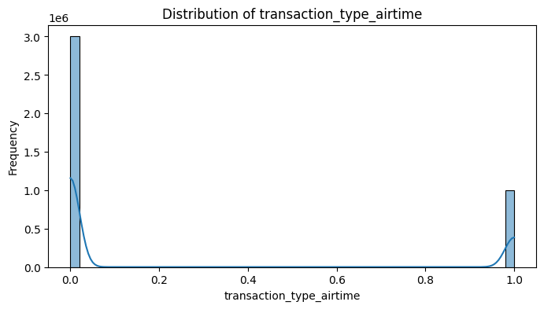

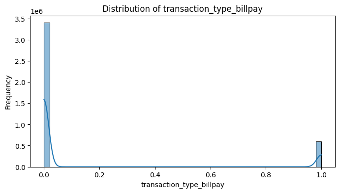


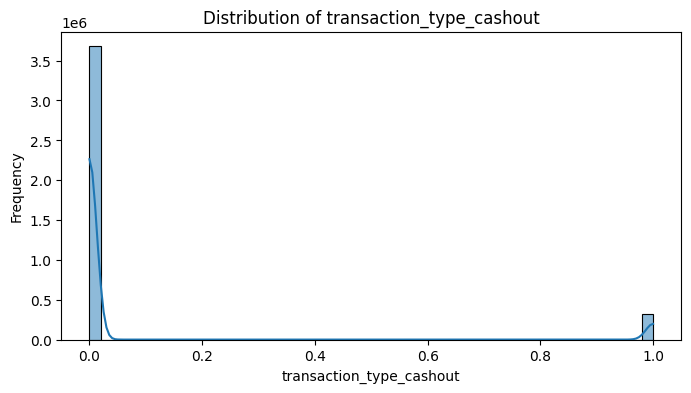

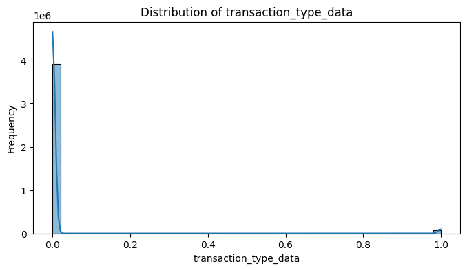

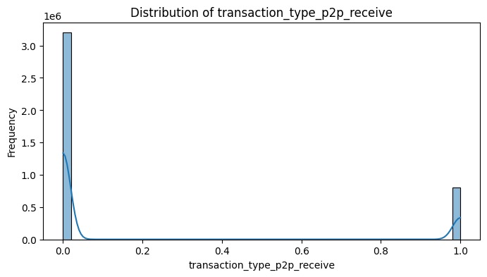

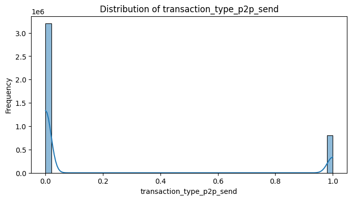

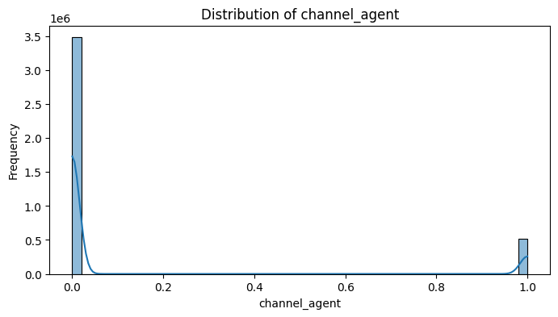

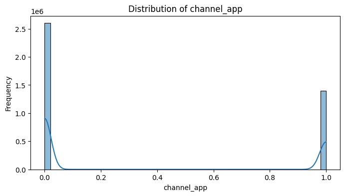

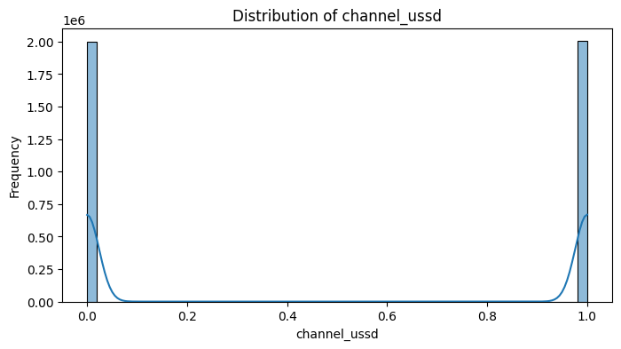

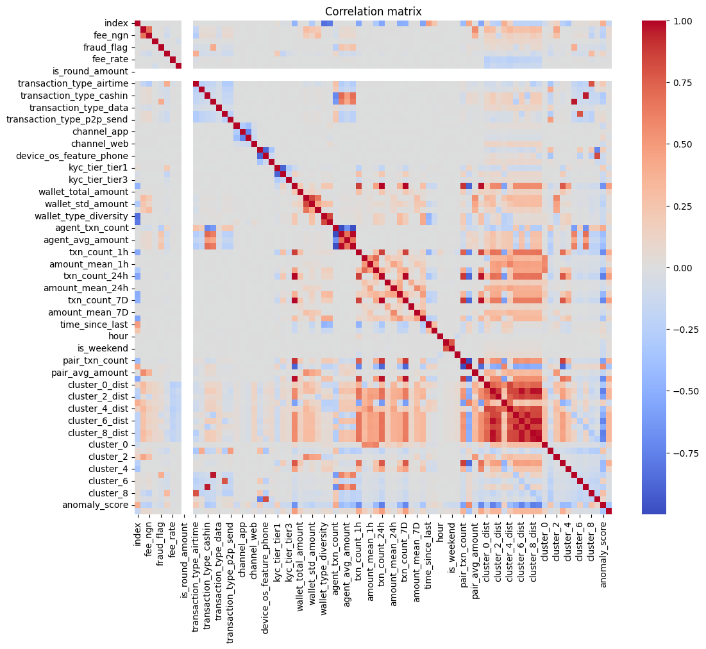

### Топ-10 признаков по абсолютной корреляции с fraud_flag
```
transaction_type_cashout    0.408045
cluster_5                   0.392801
agent_cashout_ratio         0.259408
agent_total_amount          0.256694
agent_txn_count             0.256694
agent_avg_amount            0.174666
anomaly_score               0.103112
cluster_5_dist              0.098366
cluster_1_dist              0.075761
cluster_8_dist              0.075336
```