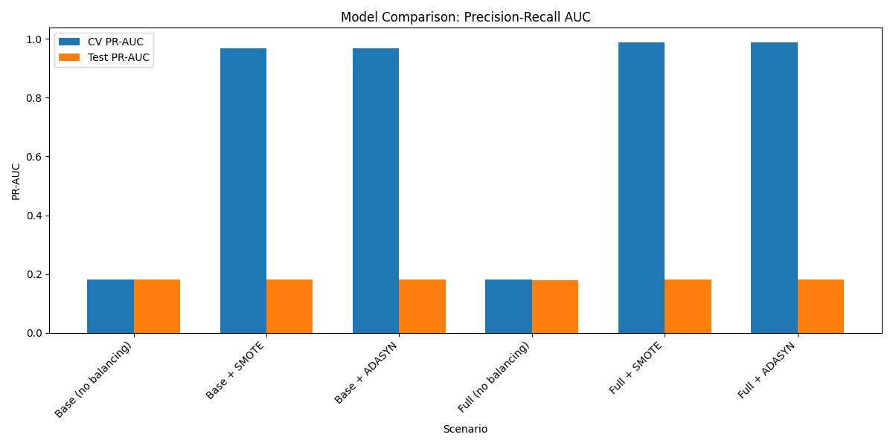
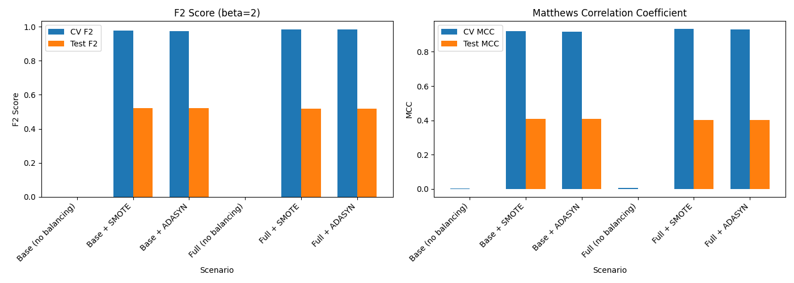
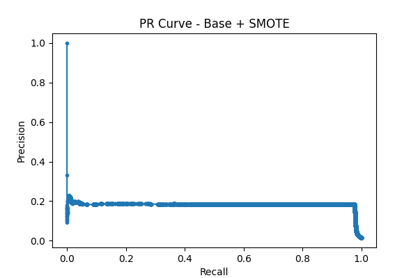
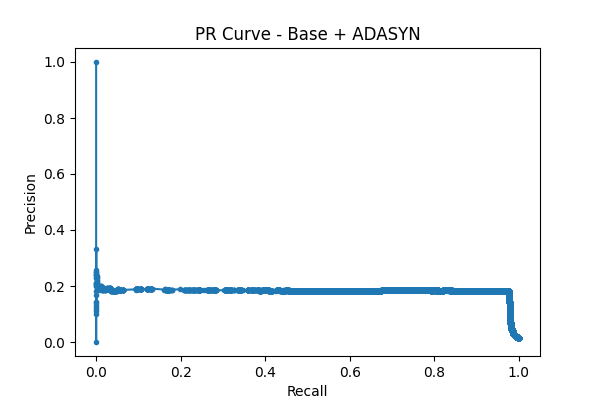
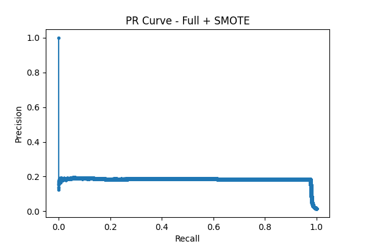
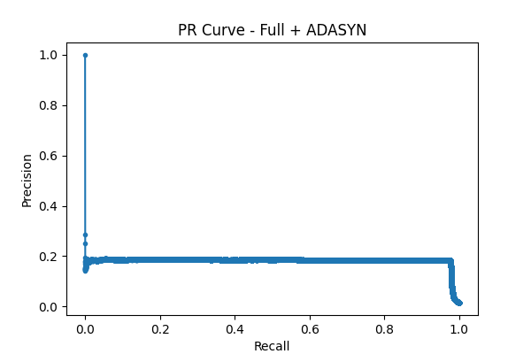

# Отчёт по моделированию обнаружения мошенничества

Дата генерации: 2026-04-03 13:07:17

## Сравниваемые сценарии
- **Base** – только базовые признаки (нормализованные числовые + one-hot)
- **Base+SMOTE** – базовые признаки с балансировкой SMOTE
- **Base+ADASYN** – базовые признаки с балансировкой ADASYN
- **Full** – все сгенерированные признаки (временные, графовые, кластеризация, аномалии, автоэнкодер)
- **Full+SMOTE** – полные признаки + SMOTE
- **Full+ADASYN** – полные признаки + ADASYN

## Метрики оценки
- **PR-AUC** – площадь под кривой Precision-Recall (основная для несбалансированных данных)
- **F2** – F-мера с акцентом на полноту (β=2), важна для обнаружения мошенничества
- **MCC** – коэффициент корреляции Мэттьюса (сбалансированная метрика)

## Сводная таблица результатов

| Сценарий | Test PR-AUC | Test F2 | Test MCC | CV PR-AUC | CV F2 | CV MCC |
|----------|-------------|---------|----------|-----------|-------|--------|
| Base (no balancing) | 0.1806 | 0.0000 | 0.0000 | 0.1814 | 0.0000 | 0.0019 |
| Base + SMOTE | 0.1819 | 0.5227 | 0.4075 | 0.9669 | 0.9755 | 0.9206 |
| Base + ADASYN | 0.1816 | 0.5227 | 0.4075 | 0.9673 | 0.9734 | 0.9177 |
| Full (no balancing) | 0.1782 | 0.0000 | -0.0001 | 0.1813 | 0.0001 | 0.0040 |
| Full + SMOTE | 0.1824 | 0.5177 | 0.4024 | 0.9872 | 0.9834 | 0.9322 |
| Full + ADASYN | 0.1818 | 0.5177 | 0.4024 | 0.9878 | 0.9830 | 0.9318 |

## Лучшие модели по метрикам

### Лучшая по PR-AUC: **Full + SMOTE**
- Test PR-AUC = 0.1824
- Test F2 = 0.5177
- Test MCC = 0.4024

### Лучшая по F2: **Base + SMOTE**
- Test F2 = 0.5227
- Test PR-AUC = 0.1819

### Лучшая по MCC: **Base + SMOTE**
- Test MCC = 0.4075
- Test PR-AUC = 0.1819

## Анализ влияния признаков
- Полные признаки без балансировки улучшают PR-AUC на -1.3% по сравнению с базовыми.

## Влияние методов балансировки

### Base признаки
- Без балансировки: PR-AUC = 0.1806
- +SMOTE: 0.1819 (изменение: +0.7%)
- +ADASYN: 0.1816 (изменение: +0.6%)

### Full признаки
- Без балансировки: PR-AUC = 0.1782
- +SMOTE: 0.1824 (изменение: +2.4%)
- +ADASYN: 0.1818 (изменение: +2.0%)

## Рекомендация
**Для производственного внедрения рекомендуется Full + SMOTE**, поскольку PR-AUC является наиболее информативной метрикой для несбалансированных данных.
Однако если критически важна полнота (не пропустить мошенничество), следует рассмотреть Base + SMOTE (F2 = 0.5227).

## Визуализации

### Сравнение PR-AUC

### Сравнение F2 и MCC

### Precision-Recall кривые для каждого сценария

#### Base (no balancing)
.png)

#### Base + SMOTE

#### Base + ADASYN

#### Full (no balancing)
.png)

#### Full + SMOTE

#### Full + ADASYN
